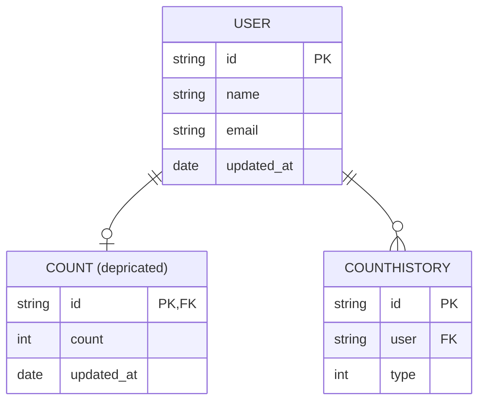

# Documentation

## Entity Relationship Diagram

```mermaid
erDiagram
USER ||--o| COUNT : ""
USER ||--o{ COUNTHISTORY : ""

USER {
    string id PK
    string name
    string email
    date updated_at
}
COUNT["COUNT (depricated)"] {
    string id PK, FK
    int count
    date updated_at
}
COUNTHISTORY {
    string id PK
    string user FK
    int type
}
```
